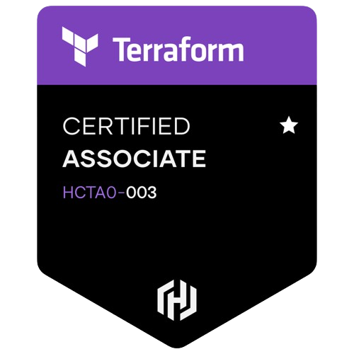

# 💫 About Me:
:dart: Competitive Programmer :cloud: Enthusiastic about MLOps and DevOps :microphone: Debating and singing

## :octocat: Leetcode:

## 🌐 Socials:
 
 

# 💻 Tech Stack:
                         
# 📊 GitHub Stats:

# :medal_military: Badge:
 
